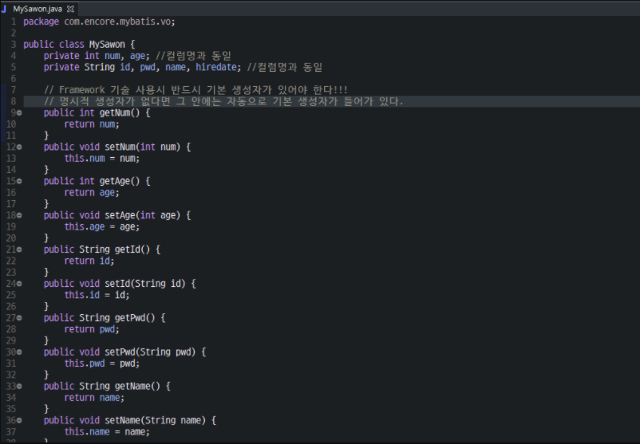
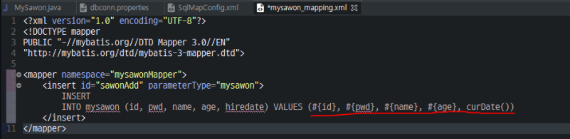
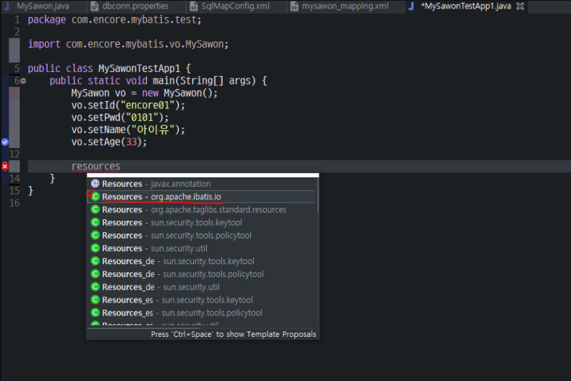

## MyBatis
- JDBC 코드와 수동으로 세팅하는 파라미터와 결과 매핑을 제거한다.

https://blog.mybatis.org/p/products.html에서 MyBatis3를 다운받으면 .jar파일이 생성이 되고 그 밑에 Spring MVC랑 연결할 때는 integration에서 Spring을 다운로드 받아서 .jar 파일을 만든다. 그러니까 총 2개의 .jar파일이 생성된다.

 
 
 

1. 먼저 db에 연결시킬 테이블을 만든다.

2. VO를 생성한다.

3. properites 파일을 만들어서 DB서버에 대한 파편적인 정보를 저장하는 메타데이터를 생성한다.

4. SqlMapConfig 파일(MyBatis 기술 핵심문서)을 만든다.

그림을 보면 오른쪽 문서가 왼쪽 문서의 정보를 필요로 하여 가져다 쓰는데 이것을 wiring(연결)이라고 한다. 클래스가 연결된 형태는 Hasing(Has a relation)이라고 한다.

wiring 하는 옵션 == resource이다.

복수태그로 끝나는 그 밑에는 단수 태그가 오고 단수 태그 안에 alias 옵션을 정의해줘서 그림과 같이 경로의 이름은 mySawon으로 줄여준다.

default는 반드시 넣고 id와 같은 값으로 넣어야 한다. 이때, 연관성 있게 넣주면 좋다. 그리고 JDBC 환경 구축이기 때문에 transactionManager 태그에 type="JDBC"로 넣어준다.

datasource는 미리 연결되어 있는 Resource Factory를 사용한다.

타입을 UNPOOLED하게 되면 메인에서 돌리는 DriverManager 방식이다. 서버에서 돌리려면 POOLED로 바꿔줘야 한다.

이때, value는 단순파라미터로 넣는다. EL 문법으로 key를 넣으면 값을 받아올 수 있게 해준다.
최종적으로 환경구축을 구현하기 위해서 wiring시킨 코드가 바로 위의 그림이다.

DB와 DAO를 효율적으로 연결하기 위해서 MyBatis를 사용한다.

1. DB정보 와이어링
2. Connection 받아온다
3. EL 문법으로 value값 넣어준 부분에서 vo의 값이 실려져서 나온다.

환경을 구축하고 난후에는 다른 xml파일을 매핑한다. 
이때는 다른 xml파일을 생성하여 매핑한다.

parameterType은 아까 SqlMapConfig.xml파일에서 alias했던 mysawon이 들어가고 mybatis에서는 그림에서 빨간 줄 형식으로 값이 들어간다.

위에 2개의 그림은 Test파일을 작성하는 부분이다.

지금까지 했던 모든 내용을 그림으로 그리면 위와 같다.

1. 가장 Back단에 DB가 존재한다.

2. 테이블의 정보를 인스턴스 시킬 수 있는 vo객체를 만든다.

MyBatis에서 가장 핵심이 되는 설정문서는 SqlMapConfig.xml이다.
dbconn.properties 파일을 wiring 하고 있고 vo에 대한 정보도 wiring하고 있다.
정말 결정적으로 모든 쿼리문을 담고(매핑하고) 있는 mysawon_mapping.xml도 연결되어있다.

코드보면, **SqlSessionFactoryBuilder**라는 애가 있다. 얘가 가져감 (주입 == DI)

SqlSessionFactoryBuilder를 또 누가 가져가냐면 **SqlSessionFactory**가 가져간다 (주입 == DI)

SqlSessionFactory또 누가 가져가나면 **SqlSession**이 가져간다 (주입 == DI)

그리고 SqlSession이 연결된다. 즉, DB에 엑세스한다.

* insert(), delete(), update()
하나 가지고 올 때 SelectOne()
여러개 가져올 때 SelectList() 

이것을 모듈화한 프레임워크가 MyBatis고, 이게 Persistence 영역이다.

위에 설명을 test 파일 다시 보면서 정리하면 빨간색 구역으로 나타낼 수 있다.

select * from mysawon을 돌릴 것인데 resultType이 필요하다. ArrayList를 썻으니까 ArrayList를 쓸 것인데 MyBatis는 ArrayList 안에 들어가는 제너릭을 넣어야 한다. 그레서 mysawon을 넣어준다. 

<select 쿼리문>

첫번째 :: selectList("namespace.id이름") -> 조건이 없는 것, 다 불러옴

두번째 :: selectList("namespace.id이름", XXX) -> 조건 있음, ex) 30번 부서 다 가져와라, 가져옴

다 작성하고 출력하면 다음과 같이 나오게 된다.

이제는 약간 변형을 해서 재사용성을 더 높이기 위해 모듈화 시킬 것이다.

select문이 잘 실행되어서 나왔다.

