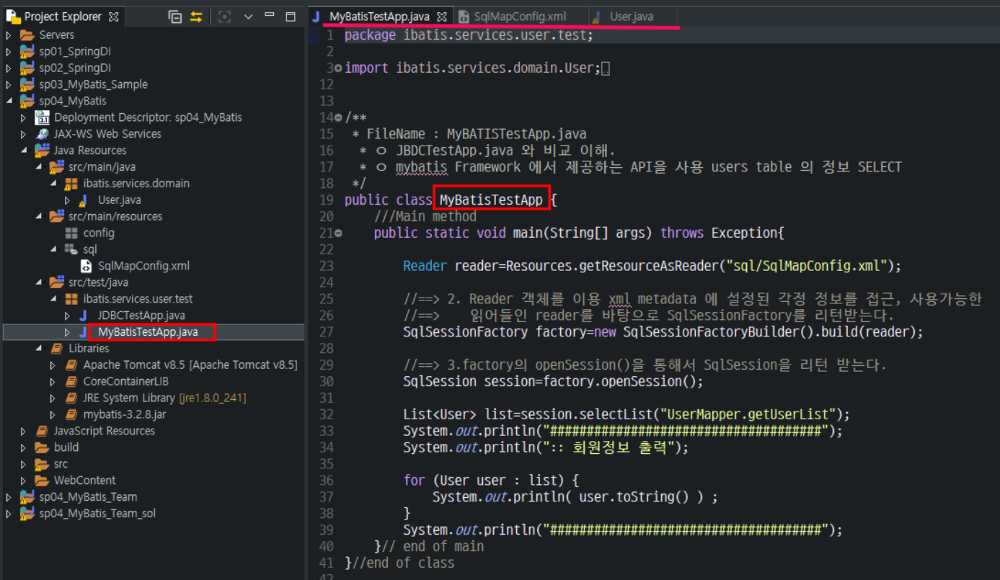
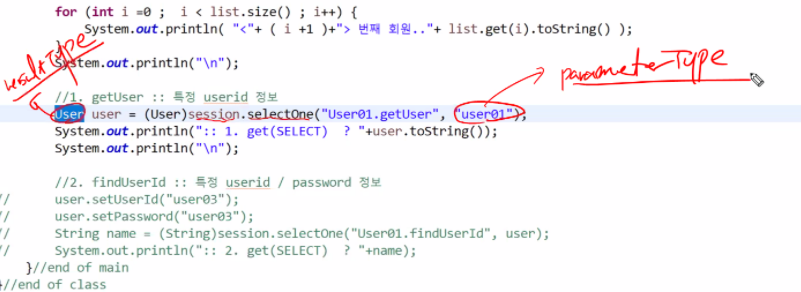
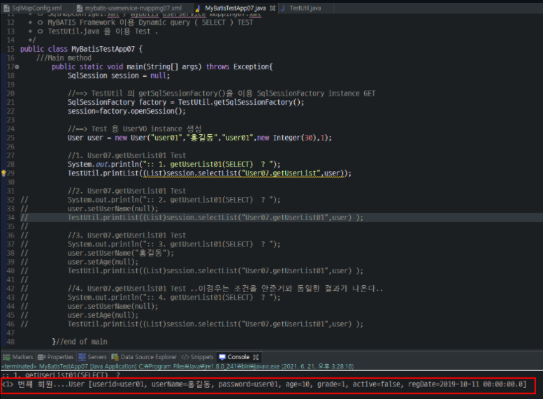

## MyBatis

1. DB 테이블 만들기

2. VO 만들기

test 파일에서 이런식으로 코드를 작성하면 길어지게 된다. 따라서 이 부분을 MyBatis를 써서 바꿔야 한다.

이 그림이 MyBatis로 바꾸는 전체적인 구조이다.
SqlMapConfig.xml 파일이 핵심이다. (핵심설정문서)
설정문서들을 wiring(와이어링)해서
위 빨간 박스 3개가 순서대로 가진다.
그러면 SqlSession이 질의(insert, delete, update)와 응답(selectOne, selectList)을 한다.
그리고 SqlSession이 UserDAO에 보내기만 한다.
그래서 DAO에서 10줄20줄 넘던게 12줄로 끝나게 된다.
DAO 부분은 굉장히 쉽고
가운데 빨간 박스로 친 부분이 제일 중요하고, 핵심적인 부분이다.

자바 부분과 sql부분 결과를 출력해주는 테스트 부분이 다 따로 존재한다.

- 항상 vo의 필드명과 DB의 컬럼명이 다를 수 있다. 자바 개발자는 CamelCase를 쓰고, DB 설계자는 언더바를 사용한다.

이렇게 SqlMapConfig.xml 파일을 작성했다.
그리고 vo, dbconn.properties, 이전 DAO 코드에 들어갔었던 SQL문을 xml 기반으로 mapping시켜서 외부 모듈화해서 이 외부 모듈화 시킨 파일 이걸 끌어당긴다.
이 이름은 mybatis-userservice-mapping.xml 로 지을 것이다.
그리고 그걸 sql 패키지에다 넣을 것이다. (mapper 패키지나, sql패키지에 넣는다)
(저번에는 mapper패키지에다 넣었지만, 이번에는 sql 패키지에다 넣는다)

이렇게 mybatis-userservice-mapping.xml파일 작성하고

테스트하면 잘 출력이 된다.

<연습>

Test파일에서 확인해보니까 resultType은 User가 되어야 하고, ParameterType으로 user01이 와야 한다.

mybatis-service-mapping에서는 #다음은 상징적이긴 하지만... value로 넣어야 한다.(해쉬맵 문법 : 단순 파라미터값 받는 통로가 된다.)
단순한 값을 받을 때는 #{value}로 받으면 된다.

SqlMapConfig파일에 등록이 안되면 MyBatis 프레임워크로 연결이 되지 않는다. 그리고 mapper 첫줄에서 에러 발생시 다음 줄도 실행이 되지 않기 때문에 반드시 에러나는 부분은 주석처리를 하고 돌아가야 한다.

결과로 2개가 나올 수 있는 것은 mappers 태그 아래 mapper 태그에서 등록이 되어 있기 떄문이다.

- id와 password가 user03인 사람을 검색

MyBatis에서 #{} 이것이 getter이다. 여기서는 vo.getter라고 보면 된다. 그래서 UserId 이걸 그대로 갖다 쓰면 되지만 대신 카멜케이스로 u가 대문자가 됐기 때문에 이걸 소문자로 바꿔준다.

그러면 #{userId}는 user.getUserId()와 같고, #{password}는 user.getPassword()와 같은 것이다.

test 파일에 출력하면 출력이 잘 된다.

- id가 user인 쿼리문 작성(user로 시작하는 id를 가지고 있는 유저들 가져오기)

단순한 값을 불러오는 것이기 때문에 parameterType="string", resultType는 list 대신 user이다. 
그냥 user면 객체이기 때문에 파라미터 타입이 user여야 하는데 위 경우는 "user"이기 떄문에 parameterType="string" 단순값을 받아오는 #{value}를 써야 한다.

잘 출력되는 것을 볼 수 있었다.

여기서는 2번을 써야 한다. parameterType이 객체인 user타입으로 되어있으면 거기서 뽑아오는거기 때문에
2번을 써서 getUserId() 함수를 호출해서 뽑아와야하는 것이다.

중요한 것은 와일드카드를 붙여줘야 출력이 된다.

- 쿼리문에다가 LIKE연산자와 와일드카드 넣기 (user로 시작하는 id를 가지고 있는 유저들 가져오기)

지금까지 한 출력 결과들을 설명하는 부분이다.

- Insert 하기
    - SqlSession으로 DB에 Insert할 것이다. DML의 경우, 반드시 commit() 해야한다.

insert의 경우, resultType은 필요가 없다.

1이 나왔다는 것은 insert에 성공했다는 뜻이다.

- update 하기

보게 되면 user_name이 주몽에서 장보고로 바뀌었다.

- Delete 하기

MyBatis에서 MySQL은 NULL값이 허용되지만 Oracle에서는 NULL값이 허용되지 않는다. 
오라클인 경우 NULL값을 처리할 때, settings 태그 안에 setting 태그로 옵션을 준다. value="NULL"이라고 대문자로 확실하게 줘야한다. 반드시 properties 태그 다음에 작성해야 한다.

- mapping07

이렇게 배포해줬는데 TestApp07 파일에서 에러가 나서 Test 패키지 밑에 배포해준다.

1. parameterMap은 iBatis에서 MyBatis로 버전업되면서 사용하지 않는다. ResultMap은 사용한다. 하지만, ResultMap을 사용하면 ResultType을 사용하지 않을 수 있다.

2. 동적인 쿼리를 모르면 정적인 쿼리만 사용해도 된다 하지만, 동적인 쿼리를 알면 보다 더 효율적인 코드를 설계, 작성할 수 있다.프레임워크에서는 사용 가능한 기능이 많다.다 알 수는 없다. 하지만, 쓰면 효율적인 코드를 짜는데 좋은 것들은 배워서 사용한다.

DB컬럼명과 vo필드명을 똑같이 쓰는 것이 중요하다. 컬럼명이랑 필드명이랑 아주 다르게 지어질 경우 Resultset에 담겨진 애를 자동으로 넣어야하는데, setter, getter name이 같아야 자동으로 제대로 들어간다.

Select구문일 때만 ResultType이 필요한데 (insert, delete, update문은 ResultType 필요없다) ResultType이 아니라 ResultMap이라는 것도 있다!!!
ResultMap은 필드명과 컬럼명이 다를 때 쓴다!!!

ResultType, ResultMap 둘의 차이

property에 getter, setter에 해당하는 내용을 넣으면 되고 column에 DB 컬럼명에 넣어주면 된다. 이렇게 결과맵을 만들어놓고 시작한다.

ResultMap을 쓰니까 쿼리문 작성에 있어서 간편하다는 것을 알았다.

이런 코드는 쿼리문이 많으면 많을수록 똑같이 더 반복될 것이다. 이래서 동적인 쿼리문을 사용하는 것이다.

- 정적 쿼리문, 동적 쿼리문 차이

정적 쿼리문은 Select문에서 where절 조건을 어떻게 주느냐에 따라서 계속적으로 쿼리문이 생성된다.

동적 쿼리문은 select문에서 where절 조건이 바뀌더라도 하나의 select문으로 여러 개의 쿼리문을 소화할 수 있어서 반복적이지 않은 쿼리문을 만들 수 있다.

select구문을 작성할 떄 where 태그를 따로 작성할 수 있고 where절 안에 이렇게 조건을 줄 수 있다.
그리고 조건을 어떻게 연결하느냐는 알아서 할 수 있다(AND냐 OR냐)

어떻게 연결해도 상관은 없지만 이 논리연산자를 두번째 if문 첫줄에 넣어야한다.
이게 동적인 쿼리인데 이게 돌리는 테스트마다 연결되어 실행되어질 것이다.

Test 파일에서의 2번과 연결해서 나이가 30인 회원만 출력되었다.

- **mapping08**

mapping08부터는 정적인 쿼리를 사용하지 않고 동적인 쿼리문으로 쓴다. 
SQL 구문의 재사용성
1. sql
2. include
옵션만 알면 SQL 구문의 재사용성을 높일 수 있다.

이런식으로 반복되는 쿼리문을 참조해서 계속해서 입력해줄 필요 없이 사용할 수 있다.

<구조>

SqlSession이 모든 것을 받고 MySQL users 테이블을 수정한다.
그림에서 분홍색 박스 부분이 MyBatis Framework이다.