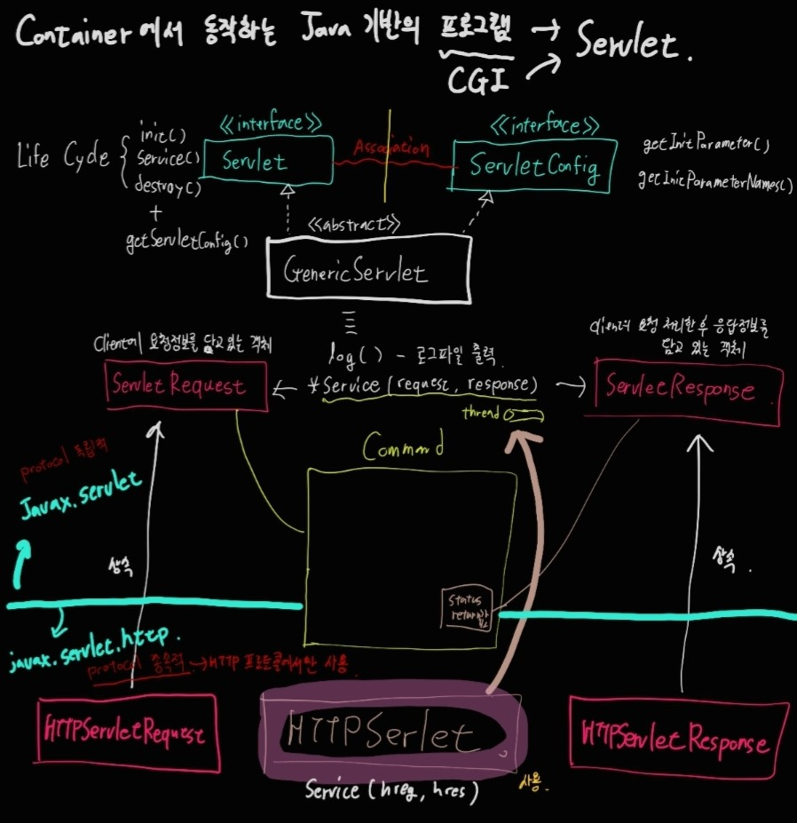
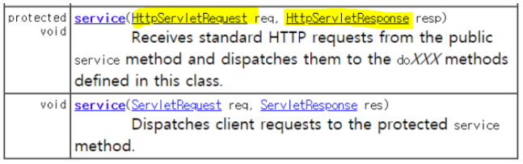

## Servlet
java를 이용하여 웹페이지를 동적으로 생성하는 서버 측 프로그램이다.
### Generic Servlet & Http Servlet



**Generic Servlet**

Servlet<<interface>>, ServletConfig<<interface>>의 자식

- Servlet는 하나의 process같은 개념이다. 그러므로 여러 요청이 있으면 프로세스 안에 쓰레드가 여러개 만들어짐.
- Thread 하나랑 맞먹는 메소드가 service이다.


- ServletRequest와 ServletResponse는 hashing 관계이다.
- javax.servlet 과 연관, 프로토콜 독립적. 모든 프로토콜(telnet, ftp, http..)에서 돌아갈 수 있는 모듈이 만들어짐

 **Http Servlet**

Generic Servlet<<abstract>>의 자식이다. 



- HttpServlet 부모의 service()를 가져다 썼지만 인자값이 달라짐.
- HttpServletRequest와 HttpServletResponse는 hasing 관계이다.
- javax.servlet.http와 연관, 프로토콜 종속적. 오직 http 프로토콜에서만 돌아갈 수 있는 모듈이 만들어짐.

결론: 우리는 Http Servlet을 사용한다.

***
- 배포, 서버 시작, 요청을 이클립스가 대신 해준다.

프로젝트 단위(ContextPath)로 배포되어야 한다.

- conf - 서버 설정 파일 webapps - 웹이 배포되는 최상위 폴더(ContextPath 단위)

- deploy 설정(배포)

서버 더블 클릭 -> Use tomcat installation... 으로 설정 -> Deploy path -> 경로 설정

***
<실습내용>
``` html
<!DOCTYPE html>
<html>
<head>
<meta charset="EUC-KR">
<title>Insert title here</title>
</head>
<body>
<form action="servlet">
Send Datat :: <input type="text" name="data">
<input type="submit" value="SEND">
</form>
</body>
</html>
```

- form action="서버로 이동할 페이지"
-> 서버로 이동하는 문구

- text 타입의 이름이 데이터인 입력값을 가지고, submit은 send라는 박스를 클릭하면 서버로 이동할 페이지로 가게 된다.

``` java
@webServlet("/servlet")
public class FormServlet extends HttpServlet{
    private static final long serialVwesionUID = 1L;

    public FormServlet(){
        super();
    }

    protected void doGet(HttpServletRequest request, HttpServletResoinse response) throws ServletException, IOException{
        String data = request.getParameter("data");
        PrintWriter out = response.getWriter();
        out.println("<html><body>");
        out.println("<h2>Client send Data..<br>");
        out.println(data + "</h2></body></html>");
        out.close();
    }
}
```

요청으로부터 name="data"인 파라미터를 받아 data변수에 할당하고 응답을 출력하는 스트림 getWriter를 받아 PrintWriter타입의 out변수에 저장한다. out에 html형식으로 담아 출력하고 out을 닫아준다.

``` html
<!DOCTYPE html>
<html>
<head>
<meta charset="EUC-KR">
<title>Insert title here</title>
</head>
<body>
<!--
form 태그는 다양한 입력양식들을 하나로 묶는 태그 
form 태그는 필수속성 action을 가진다.
action="서버로 이동할 페이지"
-->
<h2>=======Form Servlet ============</h2>
<form action="FormServlet">
NAME <input type="text" name="name"><br><br>
ADDR <input type="text" name="address"><br><br>
<input type="reset" value="CLEAR">
<input type="submit" value="전송">
</form>
</body>
</html>
```

form에 name과 address를 파라미터 이름으로 하는 값들을 담아 FormServlet으로 데이터를 보낸다

``` html
package servlet.form;

import java.io.IOException;
import java.io.PrintWriter;

import javax.servlet.ServletException;
import javax.servlet.annotation.WebServlet;
import javax.servlet.http.HttpServlet;
import javax.servlet.http.HttpServletRequest;
import javax.servlet.http.HttpServletResponse;

/**
 * Servlet implementation class HttpFormServlet
 */
@WebServlet("/FormServlet")
public class HttpFormServlet extends HttpServlet {
	private static final long serialVersionUID = 1L;
       
    /**
     * @see HttpServlet#HttpServlet()
     */
    public HttpFormServlet() {
        super();
        // TODO Auto-generated constructor stub
    }

	/**
	 * @see HttpServlet#service(HttpServletRequest request, HttpServletResponse response)
	 */
	protected void service(HttpServletRequest request, HttpServletResponse response) throws ServletException, IOException {
		//1. 클라이언트 폼값을 받는다...
		String name = request.getParameter("name");
		String addr = request.getParameter("address");
	
		//2. 받은 값을 디비가서 잘 연결했다 치고...
		//3. 다시 화면으로 응답...출력...
		//Tomas Hello!!
		PrintWriter out = response.getWriter();
		out.println("<html><body><h3>");//화면에 출력이여서 html 넣어야 함
		out.println("Your Name Information...</h3><br>");
		out.println("<li> Your Name " + name);
		out.println("</li></body></html>");
		out.close();
	}

}
```

Servlet은 프로세스 역할, service 메서드는 클라이언트의 다양한 요청을 처리할 Thread의 역할이다.
그 다음은 앞과 같이 response.getWriter()를 이용해서 out에 메시지들을 담아 출력


