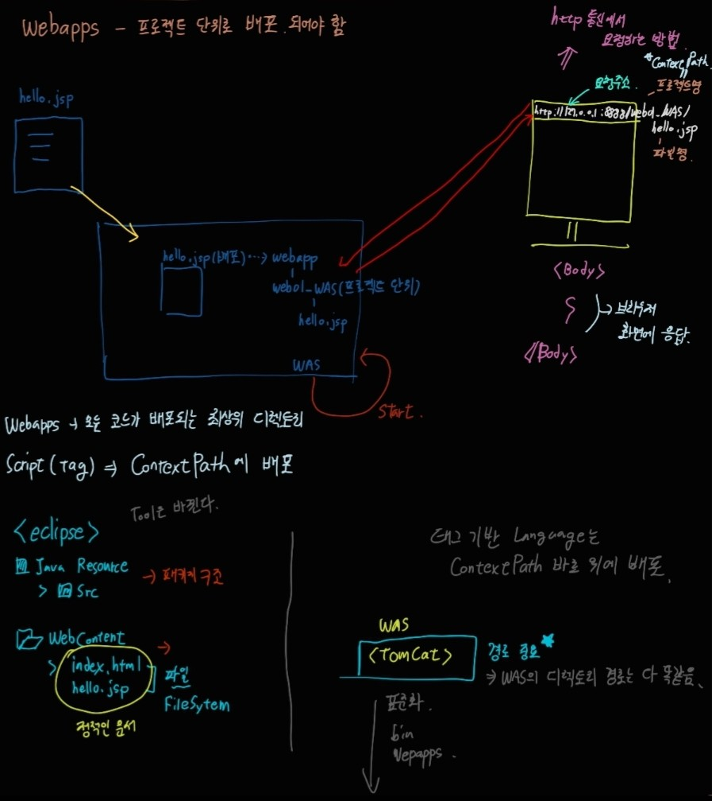
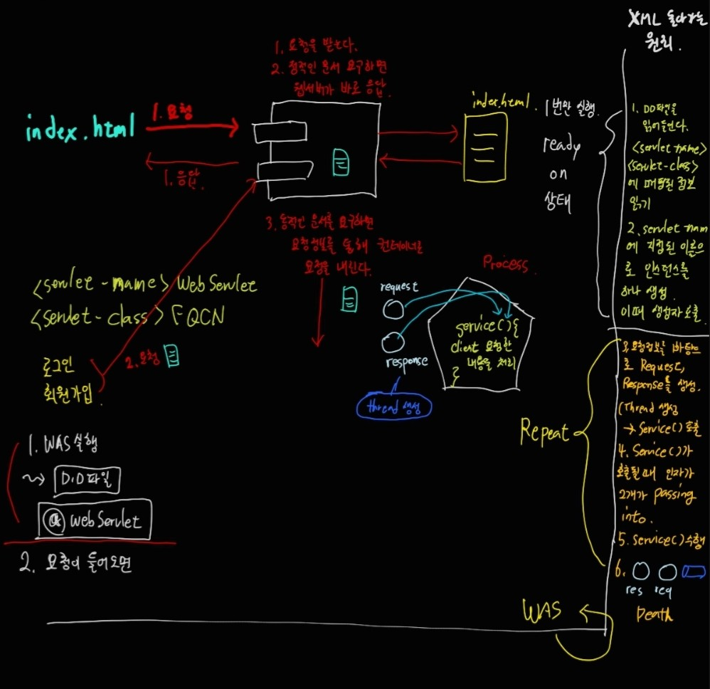

## WAS

**<용어정리>**
**Web Server: htttpd(demon)**

웹 브라우저 클라이언트로부터 HTTP 요청을 받아들이고, HTML문서와 같은 웹 페이지에서 흔히 찾아 볼 수 있는 자료 컨텐츠에 따라 HTTP에 반응하는 컴퓨터 프로그램

1. 브라우저에서 들어오는 모든 요청을 받는다.
2. 해당하는 요청이 정적인 요청인지 동적인 요청인지를 판단
3. 정적인 요청이라면 직접 응답한다.
4. 동적인 요청이면 요청을 Container로 내린다. (요청 정보와 함께)

 **Web Container**

JSP와 Servlet을 실행시킬 수 있는 소프트웨어를 Web Container 혹은 Servlet Container라고 한다. 웹 서버에서 JSP를 요청하면 톰캣에서는 JSP파일을 Servlet으로 변환하여 컴파일을 수행하고, Servlet 수행결과를 웹서버에게 전달하게 된다. 
***

#### WAS배포



원래는 IDE에서 자동적으로 적용해주는 부분인데 WAS를 배포하는 과정이다. 배포 경로는 webapps로 배포한다.

- 주소 형식은 "ip:port번호/Context path/요청한 파일"이다.
jsp파일 내 body 부분은 브라우저 화면에 응답하는 부분이다.

- 태그 기반 언어는 프로젝트..즉, Context Path 밑에 배포된다. html,jsp 등의 정적인 문서들은 webcontent 밑으로 들어간다.

- WEB-INF문서를 기준으로 정적인 문서와 동적인 프로그램이 구분된다.

### 웹서버가 하는 일
1. 브라우저에서 하는 모든 요청을 받는다.
2. 해당하는 요청이 정적인지 동적인지 판단
정적인 요청 --> 직접 응답 ,동적인 요청 --> 요청을 container로 내린다.

- Web Application은 Web site(정적 서비스) + CGI(동적 서비스)이다

- CGI는 컨테이너에 있는 동적 서비스로 대표적으로 servlet, jsp 등이 있다.


<br>
<br>

### WAS 구동원리


- **Start (=> Ready On 상태)**

    1) D.D(web.xml) 파일을 읽어들인다.= @WebServlet(annotation)
        <servlet-name>
        <servlet-class>에 Mapping된 정보를 읽어 들인다.
    2) servlet-name에 지정된 이름으로 객체를 하나 생성 → 이때 생성자 호출

1. **클라이언트 요청**

    1) 요청을 받는다.

    2) 정적인 문서면 웹 서버가 바로 응답을 한다.

    3) 동적은 문서면 요청정보와 함께 컨테이너로 요청을 내린다.

2.  **동적인 문서 일 경우 Servlet( ⇒ Repeat)**

    1) 요청 정보를 바탕으로 Request, Response를 생성

         Thread 생성 (service() 호출)

    2) Service() 가 호출 될 때 인자값 2개가 passing into

    3) Service() 수행

    4) 요청 객체, 응답 객체, Thread Death...

```sql
<?xml version="1.0" encoding="UTF-8"?> <!-- xml 선언부 -->
<web-app xmlns:xsi="http://www.w3.org/2001/XMLSchema-instance" xmlns="http://java.sun.com/xml/ns/javaee" xsi:schemaLocation="http://java.sun.com/xml/ns/javaee http://java.sun.com/xml/ns/javaee/web-app_2_5.xsd" id="WebApp_ID" version="2.5">
<!-- root tag : 한번만 선언 -->
	<!-- A Servlet Instnace (서블릿 하나) -->
	<servlet>
		<!-- 1. 서버 내부 이름 매핑 -->
		<servlet-name>MyWebServlet</servlet-name> 서버 내부 이름, 이 이름으로 서블릿을 만든다.
		<servlet-class>servlet.web.MyWebServlet</servlet-class> 패키지 명을 포함한 경로
	</servlet>
	<servlet-mapping>
		<!-- 2. Client URL 매핑 -->
		<servlet-name>MyWebServlet</servlet-name>
		<url-pattern>/MyServlet</url-pattern>
	</servlet-mapping>
</web-app>
```

xml, html 둘 다 태그 기반 데이터

xml은 메타 데이터로 tag 자체가 의미를 내포한다.

WAS가 web.xml을 보고 서블릿을 생성한다.

**D.D vs annotation**

D.D : 서버 버전을 다운그레이드(2.5) 하면 web.xml 파일이 생긴다.

annotation : 자동으로 서블릿 객체를 생성해준다. 서블릿 파일에 @WebServlet("")을 넣어준다.

### 전체적인 구조


***


**이클립스 한글 처리**
Window -> Preferences -> General -> workspace -> Text file encoding -> UTF-8
Window -> Preferences -> Web -> css/html/jsp 전부 UTF-8로 변경

**request와 response 값 한글 처리**

```java
request.setCharacterEncoding("UTF-8");
response.setContentType("text/html; charset=utf-8");
```