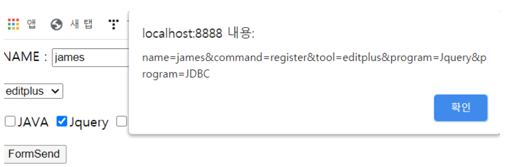
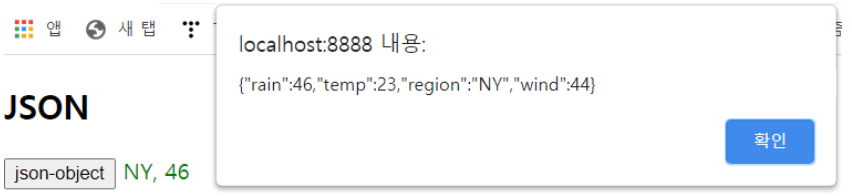
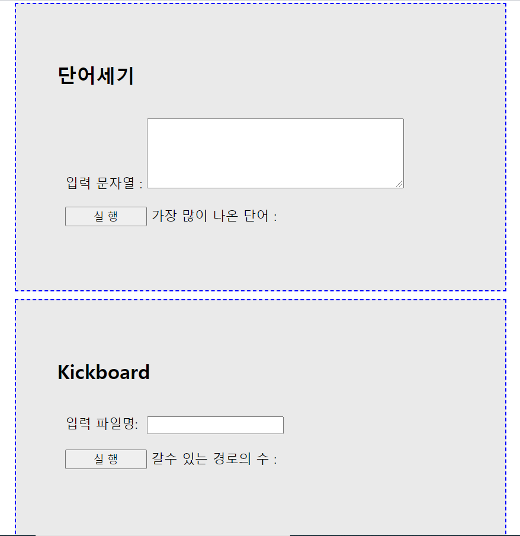
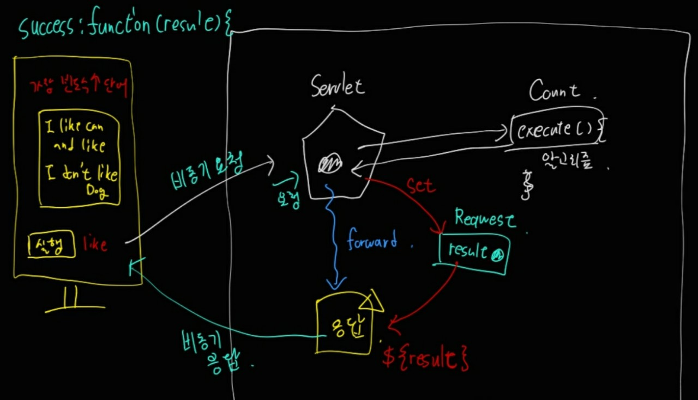

## AJAX + JQuery

자바스크립트에서 비동기를 활용하는 법을 배웠었는데 JQuery에서도 AJAX를 활용해볼 수 있다.

``` html
<!DOCTYPE html>
<html>
<head>
<meta charset="UTF-8">
<title>Insert title here</title>
<script src="https://ajax.googleapis.com/ajax/libs/jquery/3.6.0/jquery.min.js"></script>
<script type="text/javascript">
	$(function() {	
		$('#ajaxBtn').click(function() { //버튼을 클릭하면 Ajax 연결되도록 로직을 작성
			//alert("ajax...");
			$.ajax({
				type:"post",
				url:"HelloAjax",
				data:"name=encore",
				
				// 서버측에서 보내는 데이타를 받아서 응답하는 callback 함수를 호출
				success:function(result){
					alert(result);
				},				
				//에러가 발생되면 호출되는 callback 함수를 연결..
				error:function(){
					alert("응답시간이 지연...Error 처리!!");
				},
				timeout:1000 //1초 동안 서버로 부터의 응답이 없으면 에러 발생(응답 대기시간을 지정)
			});//ajax		
		});//click		
	}); //ready
</script>
<style type="text/css">
```

기본적인 형태는 위 코드와 같이 구성된다.
JQuery에서 특정한 버튼을 클릭하면 비동기를 연결되도록 로직을 작성하게 되는데 이때 들어가야 되는 부분이 **type,url,data, callback함수**이다.

이 예제에서는 성공했을 경우 서버측에서 데이터를 받아서 응답하고, 에러 발생시 에러 메시지를 호출하게 된다. 이렇게 연결된 페이지는 HelloAjax라는 서블릿으로 이동하게 된다.

``` java
package servlet.ajax;

import java.io.IOException;
import java.io.PrintWriter;

import javax.servlet.ServletException;
import javax.servlet.annotation.WebServlet;
import javax.servlet.http.HttpServlet;
import javax.servlet.http.HttpServletRequest;
import javax.servlet.http.HttpServletResponse;

@WebServlet("/HelloAjax")
public class HelloAjax extends HttpServlet {
	private static final long serialVersionUID = 1L;
	protected void doPost(HttpServletRequest request, HttpServletResponse response) throws ServletException, IOException {
		PrintWriter out = response.getWriter();
		
		String name = request.getParameter("name");
		System.out.println("name: "+name);//encore...일단 요청이 잘 들어갔는지를 확인!!
		
		try {
			Thread.sleep(1000);
		}catch(InterruptedException e) {
			
		}
		
		out.print(name);//이때 응답이 들어간다...Ajax에서 응답을 받는 부분의 코드는 아직 작성 안되어 있다...
	}

}
```

request로 폼값을 요청하게 되고 마지막 out.print(name); 부분에서 응답이 들어가는 형태가 된다.

## Serialize

``` html
<!DOCTYPE html>
<html>
<head>
<meta charset="UTF-8">
<title>Insert title here</title>
<script src="https://ajax.googleapis.com/ajax/libs/jquery/3.6.0/jquery.min.js"></script>
<script type="text/javascript">
	$(function(){
    	$('#frm').submit(function () {
    		//폼에 입력된 값을 다 서버로 보내는 기능....serialize() :: 입력값들을 쿼리스트링으로 만들어서 전송한다.
    		var query = $(this).serialize(); 
    		alert(query);
    		return false;   		
		});
    
	});
</script>
<style type="text/css">

</style>
</head>
<body>
<form action="SerializeServlet" id="frm">
	NAME : <input type="text" name="name">
	<input type="hidden" name="command" value="register"><p>
	
	<select name="tool">
		<option value="editplus">editplus</option>
		<option value="eclipse">eclipse</option>
		<option value="starUML">starUML</option>
	</select><P>
	
	<input type="checkbox" name="program" value="JAVA">JAVA
	<input type="checkbox" name="program" value="Jquery">Jquery
	<input type="checkbox" name="program" value="Spring">Spring
	<input type="checkbox" name="program" value="JDBC">JDBC
	<p>
	<input type="submit" value="FormSend">
</form>
</body>
</html>
```

원래는 form에서 submit을 하면 SerializeServlet으로 이동되지만, form의 id인 frm을 이용해서 $('#frm').submit을 명시해서 서블릿으로 넘어가기 전에 해당 이벤트가 먼저 진행되게 할 수 있다. 그 후에 serialize를 통해서 폼에 입력된 값을 다 서버로 보내게 하고, 입력값들을 쿼리스트링으로 만들어서 전송하게 된다. 이때, return false를 사용해서 폼이 SerializeServlet으로 날아가지 않게 해준다.



alert로 문자형태의 데이터를 표현해주었다.

## Json

``` html
<!DOCTYPE html>
<html>
<head>
<meta charset="UTF-8">
<title>Insert title here</title>
<script src="https://ajax.googleapis.com/ajax/libs/jquery/3.6.0/jquery.min.js"></script>
<script type="text/javascript">
	
    $(function(){
    	$('#jsonBtn').click(function () {
			$.ajax({
			type:'post',
			url:'JsonServlet',
			dataType:'json', //응답하는 데이터 타입이 객체일 때 json이라고 지정...
			
			success:function(data){//data변수로 json 객체를 응답받겠다.
				//alert(data);
				//특정 영역에 객체의 내용을 출력...
				//alert(data.weather);
				$('#resultView').html('<font color=green>'+data.weather+'</font>');
			}//callback   
		});//ajax
    	});//click
	});
</script>
<style type="text/css">

</style>
</head>
<body>
	<h2>JSON...</h2>
	<input type="button" value = "jsoon-object" id="jsonBtn">
	<span id = "resultView"></span>
</body>
</html>
```

'키:값' 형식인 파일 Json을 받아오기 위해서는 json.jar라는 라이브러리를 추가한 후 JSONObject 객체를 생성한다. 그 후 버튼을 클릭하여 JsonSerlvet에 요청이 들어가게 된다.

``` java
package servlet.ajax;

import java.io.IOException;
import java.io.PrintWriter;

import javax.servlet.ServletException;
import javax.servlet.annotation.WebServlet;
import javax.servlet.http.HttpServlet;
import javax.servlet.http.HttpServletRequest;
import javax.servlet.http.HttpServletResponse;

import org.json.JSONObject;

import domain.weather;

@WebServlet("/JsonServlet")
public class JsonServlet extends HttpServlet {
	private static final long serialVersionUID = 1L;

	protected void doPost(HttpServletRequest request, HttpServletResponse response) throws ServletException, IOException {
		PrintWriter out = response.getWriter();
		
		//1. JSON 객체를 하나 생성...json.jar가 있어야 한다.
		JSONObject json = new JSONObject();
		
		//json.put("region", "busan");
		//json.put("region", "busan");
		//json.put("region", "busan");
		//json.put("region", "busan");
		
		//2. Weather 객체를 생성
		weather weather = new weather();
		weather.setRegion("서울");
		weather.setWind(44);
		weather.setTemp(23);
		weather.setRain(46);
		
		//3. 객체를 json에 put
		json.put("weather", weather);
		
		//4.객체를 전송
		out.print(json);
	}

}
```

Json서블릿에서는 객체를 생성하고 초기화 해준 후 객체를 put함수를 통해서 json에 넣어준다. 후에 out.print()로 객체를 전송하게 되면 아래와 같이 진행된다.



## 알고리즘 적용

``` html
<!DOCTYPE html>
<html>
<head>
<meta charset="UTF-8">
<title>Java Call</title>
<script src="http://code.jquery.com/jquery-3.1.1.js"></script>

<script type="text/javascript">
	$(function() {
		$('#exec1').click(function () {
    	//TextArea에 입력된 값을 받아온다.
    	var words = $('#words').val();//이 값을 서블릿으로 연결...서블릿이 Count의 메소드로 인자값 넘기도록
    	$.ajax({
    		//요청
    		url:'main.do?command=wordCount',
    		type:'post',
    		data: {"words":words},
    		error:function (xhr,status,message) {
    			alert('error : '+message);
			},
			//응답
			success:function (result) {
    			$('#result1').html(result);
			}//callback
    	});//ajax
		});//click
		
		$('#exec2').click(function () {
			var fname = $('#fname').val();//파일 이름만 받아온다.
			$.ajax({
				url:'main.do?command=kickCount',
				type:"post",
				data:{'fname':fname},
				error:function (xhr,status,message) {
    			alert('error : '+message);
			},
			//응답
			success:function (result) {
    			$('#result2').html(result);
			}//callback
			});    
		});//click
	});
</head>
<body>
	<div id="q1"  class="quest">
			<h2>단어세기</h2>
			<div><span id="ins">입력 문자열 : </span><textarea  id="words" cols="45" rows="5"></textarea> </div>
			<div><input type="button" id="exec1" class="btn" value="실 행"> 가장 많이 나온 단어 :	<span id="result1"  ></span></div>			
	</div>
	<div id="q2" class="quest">
		<h2>Kickboard</h2>
		<div><span class="kick">입력 파일명:</span><input type="text" id="fname" ></div>
		<div> <input type="button"	id="exec2" class="btn" value="실 행"> 갈수 있는 경로의 수 : <span id="result2">  </span></div>
	</div>
</body>
</html>
```

중간에 스타일부분을 생략하고 코드를 봤을 때 이 코드는 총 버튼이 2개가 있는데 클릭할 때 각기 다른 알고리즘이 실행된다.

각각의 해당하는 url로 요청이 들어가고 command가 파라미터로 넘겨진다.

``` java
package com.encore;

import java.io.File;
import java.io.FileNotFoundException;
import java.io.IOException;

import javax.servlet.ServletException;
import javax.servlet.annotation.WebServlet;
import javax.servlet.http.HttpServlet;
import javax.servlet.http.HttpServletRequest;
import javax.servlet.http.HttpServletResponse;

@WebServlet("/main.do")
public class MainServlet extends HttpServlet {
	private static final long serialVersionUID = 1L;

	protected void doGet(HttpServletRequest request, HttpServletResponse response) throws ServletException, IOException {
		doProcess(request, response);
	}

	protected void doPost(HttpServletRequest request, HttpServletResponse response) throws ServletException, IOException {
		doProcess(request, response);
	}
	
	protected void doProcess(HttpServletRequest request, HttpServletResponse response) throws ServletException, IOException {
		//로직은 여기다 작성...
		String command = request.getParameter("command");
		System.out.println("command :"+command);
		
		if(command.equals("wordCount")) {
			wordCount(request,response);
		}else if(command.equals("kickCount")) {
			kickCount(request, response);
		}
	}
	private void kickCount(HttpServletRequest request, HttpServletResponse response) throws ServletException, IOException {
		String fname = request.getParameter("fname");
		
		String path = request.getServletContext().getRealPath("/res");//알아두세요...
		System.out.println("path :"+path);
		
		File file = new File(path,fname);
		
		int count = new Kickboard().execute(file);
		
		request.setAttribute("result", count);
		request.getRequestDispatcher("Result.jsp").forward(request, response);
	}

	//해당 모듈 안에서만 사용되고 다른 모듈에서는 불려지는 일이 없을 때...함수 앞에 private
	private void wordCount(HttpServletRequest request, HttpServletResponse response) throws IOException,ServletException{
		String words = request.getParameter("words");
		//알고리즘 자바 클래스이 execute()함수 호출하려면...Count클래스 객체를 생성
		String result = new Count().execute(words);
		
		//바인딩
		request.setAttribute("result", result);
		request.getRequestDispatcher("Result.jsp").forward(request, response);
	}

}
```

``` html
<%@ page language="java" contentType="text/html; charset=UTF-8"
    pageEncoding="UTF-8"%>
<!DOCTYPE html>
<html>
<head>
<meta charset="UTF-8">
<title>Insert title here</title>
</head>
<body>
${result}
</body>
</html>
```

요청을 받아 서블릿에서 각각의 알고리즘에 해당하는 데이터들을 바인딩 시킨 후에 Result.jsp로 이동시킨다. 그 후에 jsp파일에서 ${result}에 서블릿에서 바인딩한 데이터들이 들어가 있다. 그렇게 각각에 해당하는 알고리즘들이 버튼을 누르면 출력이 되는 구조가 된다.



count 부분의 아키텍쳐를 그려보면 다음과 같다. 이렇게 그림으로 해보면 훨씬 이해가 더 잘 될 수 있을 것 같다.

